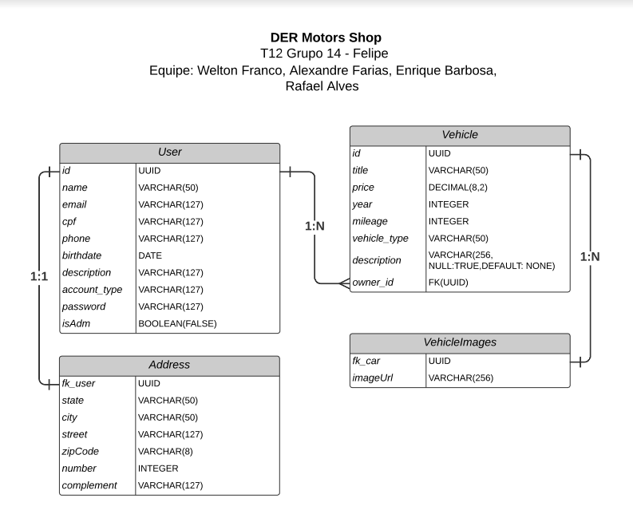

# Motors Shop

## Tabela de Conteúdos

- [Motors Shop](#motors-shop)
  - [Tabela de Conteúdos](#tabela-de-conteúdos)
  - [1. Visão Geral](#1-visão-geral)
  - [2. Diagrama ER](#2-diagrama-er)
  - [3. Início Rápido](#3-início-rápido)
    - [3.1. Instalando Dependências](#31-instalando-dependências)
    - [3.2. Variáveis de Ambiente](#32-variáveis-de-ambiente)
    - [3.3. Migrations](#33-migrations)
  - [4. Autenticação](#4-autenticação)
  - [5. Endpoints](#5-endpoints)

---

## 1. Visão Geral

Aplicação back-end de leilão, compra e venda de veículos..

Logo abaixo temos a lista de tecnologias usadas:

- [NodeJS](https://nodejs.org/en/)
- [Express](https://expressjs.com/pt-br/)
- [TypeScript](https://www.typescriptlang.org/)
- [PostgreSQL](https://www.postgresql.org/)
- [TypeORM](https://typeorm.io/)

---

## 2. Diagrama ER

[ Voltar para o topo ](#tabela-de-conteúdos)

Diagrama ER da API com suas relações entre as tabelas do banco de dados:



---

## 3. Início Rápido

[ Voltar para o topo ](#tabela-de-conteúdos)

### 3.1. Instalando Dependências

Clone o projeto em sua máquina e instale as dependências com o comando:

```shell
yarn
```

### 3.2. Variáveis de Ambiente

Em seguida, crie um arquivo **.env**, copiando o formato do arquivo **.env.example**:

```
cp .env.example .env
```

Configure suas variáveis de ambiente com suas credenciais do Postgres e uma nova database da sua escolha.

### 3.3. Migrations

Execute as migrations com o comando:

```
yarn typeorm migration:run -d src/data-source.ts
```

---

## 4. Autenticação

[ Voltar para o topo ](#tabela-de-conteúdos)

A autenticação dessa aplicação é feita através de:

```
Authorization: Bearer Token
```

Todas rotas pedem que um Bearer Token seja passado com exceção dessas:

| Método | Rota          | Descrição                       |
| ------ | ------------- | ------------------------------- |
| POST   | /users        | Criação de um usuário.          |
| GET    | /vehicles     | Listando os veículos.           |
| GET    | /vehicles/:id | Listando um veículo específico. |

---

## 5. Endpoints

[ Voltar para o topo ](#tabela-de-conteúdos)

- Login
  - POST - /login | Criação do token através do Login
- User
  - POST - /users | Criação de usuário
- Vehicle
  - POST - /vehicles | Criação de um veículo
  - GET - /vehicles | Listando os veículos
  - GET - /vehicles/:id | Listando um veículo específico
